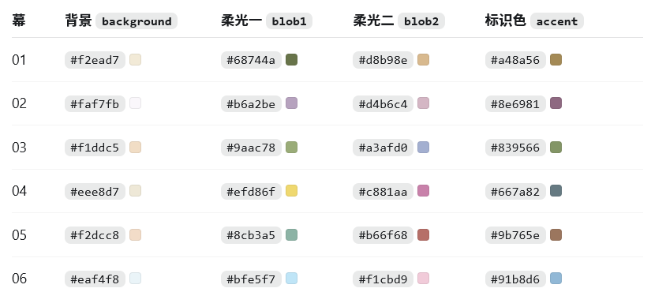

# 我的动漫偏好

基于 Astro 构建的静态动漫偏好单页。页面在构建时读取本地 Bangumi 数据，不会在访客打开页面时直接请求第三方接口。


## 本地开发

建议使用 Node.js 24。

```bash
npm install
npm run dev
```

默认开发地址为 http://localhost:3000/

（端口设置在 astro.config.mjs ）


## 同步 Bangumi 数据

同步脚本会读取用户 `860550` 的公开动画收藏，并更新：

- 看过、在看、想看数量；
- 个人评分最高的十部动画；
- 最近看过的十部动画；
- 最近评分与短评。

直接同步：

```bash
npm run sync:bangumi
```

本地需要代理时，可在 PowerShell 中执行：

```powershell
$env:HTTPS_PROXY='http://127.0.0.1:7890'
npm run sync:bangumi
```

脚本只有在全部请求和数据整理成功后才会替换 `src/data/bangumi.json`。同步失败时，旧数据会继续保留。


## 图片替换

### 替换头像

将正方形头像图片放到以下位置：

```text
public/images/profile/avatar.webp
```

推荐使用至少 `512 × 512` 像素的 WebP 图片。图片不存在时，页面会自动显示用户名首字作为占位头像。


### 替换入场图片

```
public\images\depth-gallery
```

替换里面的 01 - 06，不过替换图片的话颜色啊位置啊乱七八糟的都得调整，这个会有些麻烦，让ai辅助你调整一下。


## 页面配置

自我介绍、外部链接和个人短句开关位于：

```text
src/data/site.ts
```

将 `showFavoriteNotes` 设置为 `true` 后，评分前十条目中存在的可选 `note` 字段才会显示。

### 调整个人信息

个人信息主要在 src\data\site.ts 中调整

### 调整“我最喜欢的动漫”

最喜欢动漫的生成方式由以下文件控制：

```text
src/data/favorites.config.json
```

默认使用自动模式：

```json
{
  "mode": "auto",
  "subjects": []
}
```

自动模式会从你的 Bangumi 动画收藏中筛选已评分作品，按照个人评分、Bangumi 社区评分和更新时间排序，展示前十部。

需要自行选择作品与顺序时，将 `mode` 改为 `manual`，并按希望展示的顺序填写 Bangumi 条目 ID：

```json
{
  "mode": "manual",
  "subjects": [
    {
      "id": 400602,
      "note": "旅途结束以后，故事才真正开始。"
    },
    {
      "id": 183875,
      "score": 10,
      "note": "像是这种我bangumi没有标记过的，可以手动添加 score 这个可选字样指定评分"
    }
  ]
}
```

条目 ID 可以从 Bangumi 详情页地址中获取。例如：

```text
https://bangumi.tv/subject/400602
                            └─ ID 为 400602
```

手动模式最多展示前十条配置记录，并严格遵循配置顺序。条目即使不在你的动画收藏列表中，脚本也会直接从 Bangumi 条目接口补全基础信息；ID 填写错误或条目接口请求失败时才会被忽略。

`note` 是可选个人短句。需要显示短句时，还应在 `src/data/site.ts` 中设置：

```ts
showFavoriteNotes: true;
```

修改配置后重新同步并启动页面：

```powershell
$env:HTTPS_PROXY='http://127.0.0.1:7890'
npm run sync:bangumi
npm run dev
```

确认效果后提交并推送。GitHub Actions 和 Cloudflare 会自动同步与重新部署：

```bash
git add src/data/favorites.config.json src/data/bangumi.json
git commit -m "content: update favorite anime"
git push
```


## 开幕动效配置

主要动效参数都在 [depth-gallery.ts (line 20)](/E:/Study/My Homepage/src/scripts/depth-gallery.ts:20) 顶部：

```
const SCROLL_DAMPING = -Math.log(1 - 0.08) * 60;
const VELOCITY_DAMPING = -Math.log(1 - 0.12) * 60;
const POINTER_DAMPING = -Math.log(1 - 0.055) * 60;
```

### 1. 调整滚动惯性

最主要的是：

```
const SCROLL_DAMPING = -Math.log(1 - 0.08) * 60;
```

只调整里面的 `0.08`：

- 数值更小：惯性更长、更柔和，相机会更慢地追上滚动位置。
- 数值更大：响应更快、尾巴更短，更接近直接跟手。

实际指数阻尼运算在 [depth-gallery.ts (line 398)](/E:/Study/My Homepage/src/scripts/depth-gallery.ts:398)：

```
const scrollBlend = 1 - Math.exp(-SCROLL_DAMPING * deltaSeconds);

this.renderProgress = THREE.MathUtils.lerp(
  this.renderProgress,
  this.scrollProgress,
  scrollBlend,
);
```

建议保留这段公式和末尾的 `* 60`，这样不同刷新率下手感才会一致。

### 2. 调整速度呼吸

```
const VELOCITY_DAMPING = -Math.log(1 - 0.12) * 60;
```

它控制图片倾斜、漂移、轻微放大等效果恢复平静的速度：

- 减小 `0.12`：呼吸和漂移残留更久。
- 增大 `0.12`：效果出现和消失更快。

整体强度位于 [depth-gallery.ts (line 413)](/E:/Study/My Homepage/src/scripts/depth-gallery.ts:413)：

```
progressPerSecond * 0.7
```

调整 `0.7`：

- `0.5`：滚动反馈更克制。
- `0.7`：当前效果。
- `0.9`：漂移、倾斜和呼吸更明显。

具体视觉幅度在 [depth-gallery.ts (line 465)](/E:/Study/My Homepage/src/scripts/depth-gallery.ts:465)：

```
// 上下漂移
this.velocity * (isMobile ? 0.025 : 0.07)

// 倾斜
this.velocity * 0.035
this.velocity * 0.04

// 呼吸放大
Math.abs(this.velocity) * 0.025
```

### 3. 调整鼠标跟随

```
const POINTER_DAMPING = -Math.log(1 - 0.055) * 60;
```

这个是调整缓动的，移动幅度是在下面调整

- 减小 `0.055`：鼠标视差更柔和、更慢。
- 增大 `0.055`：图片更快跟随鼠标。

相机跟随幅度位于：

```
this.camera.position.x = this.pointerCurrent.x * 0.055;
this.camera.position.y = this.pointerCurrent.y * 0.03;
```

如果只想减弱鼠标移动距离，不改变跟随速度，就调整这里的 `0.055` 和 `0.03`。

如果想让**图片跟随鼠标的幅度**更大，改这里：

```
const parallax = opacity * (isMobile ? 0.055 : 0.18);
```

建议范围：

```
// 当前
isMobile ? 0.035 : 0.12
// 稍微明显
isMobile ? 0.05 : 0.16
// 比较明显
isMobile ? 0.065 : 0.2
```

纵向幅度由这里的 `0.45` 控制：

```
this.pointerCurrent.y * parallax * 0.45
```

可以尝试：

```
this.pointerCurrent.y * parallax * 0.65
```

### 4. 调整画廊到主页的时间比例

在 [depth-gallery.ts (line 321)](/E:/Study/My Homepage/src/scripts/depth-gallery.ts:321)：

```
const handoff = smoothstep(
  THREE.MathUtils.clamp((progress - 0.84) / 0.16, 0, 1),
);
```

当前含义是：

- 前 `84%` 滚动距离用于六张图片。
- 后 `16%` 用于第六张到主页的交接。

例如想让主页渐变更长：

```
(progress - 0.80) / 0.20
```

想让主页交接更短：

```
(progress - 0.88) / 0.12
```

同时还要修改 [depth-gallery.ts (line 409)](/E:/Study/My Homepage/src/scripts/depth-gallery.ts:409) 的：

```
this.renderProgress / 0.84
```

两处的 `0.84` 必须保持一致。

### 5. 调整整体滚动长度

在 [depth-gallery.css (line 1)](/E:/Study/My Homepage/src/styles/depth-gallery.css:1)：

```
.depth-intro {
  height: 520svh;
}
```

- `600svh`：每张图片需要滚动更久，整体更舒缓。
- `520svh`：当前长度。
- `450svh`：整体更紧凑、更快。

如果你想先尝试一种更柔和的组合，我建议：

```
const SCROLL_DAMPING = -Math.log(1 - 0.065) * 60;
const VELOCITY_DAMPING = -Math.log(1 - 0.1) * 60;
const POINTER_DAMPING = -Math.log(1 - 0.05) * 60;
```

每次修改后运行：

```
npm run build
```

最值得优先尝试的是 `SCROLL_DAMPING` 中的 `0.08`，它对整体“丝滑程度”的影响最大。


## 开幕颜色调整

核心上，你调整颜色主要看三个位置：六幕调色板、背景柔光强度、幕与幕之间的混色方式。日常换色通常只改第一处即可。

### 1. 每一幕的颜色（主要改这个）

六幕配色位于 [DepthGallery.astro (line 4)](/E:/Study/My Homepage/src/components/DepthGallery.astro:4) 的 `galleryItems`：

（示例，并不代表最终颜色）



例如第一幕：

```
{
  index: "01",
  mood: "woodland",

  // 左侧圆点以及右侧 RGB / HEX / CMYK 信息
  accent: "#a48a56",

  // 整个画面的基础底色，占据视觉面积最大
  background: "#f2ead7",

  // 左上、右下两个缓慢运动的柔光色块
  blob1: "#68744a",
  blob2: "#d8b98e",
}
```

其中 `accent` 不会大面积改变背景，它主要控制左侧颜色圆点和右侧颜色数据。真正影响环境色的是 `background`、`blob1` 和 `blob2`。

### 2. 渐变颜色的浓淡

背景并不是普通 CSS 渐变，而是着色器生成的两个大面积柔光色块。相关代码在 [depth-gallery.ts (line 63)](/E:/Study/My Homepage/src/scripts/depth-gallery.ts:63)：

```
color = mix(color, mix(uBlob1, uBackground, 0.28), firstBlob * 0.72);
color = mix(color, mix(uBlob2, uBackground, 0.34), secondBlob * 0.68);
```

这四个数字最重要：

```
mix(uBlob1, uBackground, 0.28)
```

`0.28` 表示把第一种柔光颜色冲淡多少：

- 改成 `0.15`：颜色更纯、更明显
- 当前 `0.28`：较为柔和
- 改成 `0.50`：颜色更淡，更接近基础背景

后面的 `0.72` 是第一块柔光整体混入背景的强度：

- `0.45`：很轻
- 当前 `0.72`：比较明显
- `0.85`：更浓、更有氛围感

第二块柔光的 `0.34` 和 `0.68` 作用完全相同。因此，如果你觉得颜色太浓，建议先降低 `0.72/0.68`；如果只是觉得柔光颜色发灰，则降低 `0.28/0.34`。

例如稍微淡雅一点：

```
color = mix(color, mix(uBlob1, uBackground, 0.36), firstBlob * 0.58);
color = mix(color, mix(uBlob2, uBackground, 0.40), secondBlob * 0.54);
```

### 3. 柔光范围和位置

同一文件的 [着色器位置 (line 54)](/E:/Study/My Homepage/src/scripts/depth-gallery.ts:54) 控制柔光中心：

```
vec2 firstCenter = vec2(
  -0.34 * uAspect + sin(uTime * 0.10) * 0.10,
  0.24 + cos(uTime * 0.08) * 0.08
);

vec2 secondCenter = vec2(
  0.34 * uAspect + cos(uTime * 0.07) * 0.12,
  -0.22 + sin(uTime * 0.09) * 0.08
);
```

大致含义是：

- `-0.34`：第一块柔光偏左
- `0.34`：第二块柔光偏右
- `0.24`：第一块偏上
- `-0.22`：第二块偏下
- `sin/cos` 后面的 `0.10、0.08、0.12`：漂移幅度
- `uTime * 0.10`：漂移速度，数字越大移动越快

柔光覆盖范围在 [depth-gallery.ts (line 63)](/E:/Study/My Homepage/src/scripts/depth-gallery.ts:63)：

```
float firstBlob = smoothstep(0.92, 0.05, length(...));
float secondBlob = smoothstep(1.02, 0.08, length(...));
```

前面的 `0.92/1.02` 越大，色块覆盖越宽：

```
0.75  // 较集中
0.92  // 当前范围
1.20  // 更大、更弥散
```

通常不建议同时把范围和颜色强度都调得很大，否则背景很容易变成明显的双色分区。

### 4. 每幕之间怎么混色

幕间颜色混合位于 [depth-gallery.ts (line 509)](/E:/Study/My Homepage/src/scripts/depth-gallery.ts:509)。目前是线性混合：

```
const blend = activeFloat - currentIndex;

this.backgroundMaterial.uniforms.uBackground.value
  .set(currentItem.background)
  .lerp(new THREE.Color(nextItem.background), blend);
```

也就是说，从第一幕滑向第二幕时，三组颜色都会根据滚动位置均匀地从 0% 混到 100%。

如果想让颜色切换更柔和，可以将 `blend` 改成缓入缓出：

```
const rawBlend = activeFloat - currentIndex;
const blend = rawBlend * rawBlend * (3 - 2 * rawBlend);
```

效果会是：开头变化较慢，中间加快，接近下一幕时再次放慢。当前线性版本会更直接，缓入缓出版本则更丝滑。

### 5. 滚动时的提亮和颗粒

同一个着色器里还有两个与颜色观感相关的参数：

```
color += abs(uVelocity) * 0.045;
```

这是滚动速度产生的提亮：

- `0`：完全关闭
- `0.025`：比较轻
- 当前 `0.045`
- `0.07`：滚动时明显发亮

```
color += grain * 0.022;
```

这是背景颗粒强度：

- `0`：完全干净
- `0.01`：非常轻
- 当前 `0.022`
- `0.04`：明显胶片颗粒

它们都在 [depth-gallery.ts (line 69)](/E:/Study/My Homepage/src/scripts/depth-gallery.ts:69)。

### 6. 第六幕到主页的颜色交接

主页顶部渐变在 [depth-gallery.css (line 11)](/E:/Study/My Homepage/src/styles/depth-gallery.css:11)：

```
background: linear-gradient(
  to bottom,
  rgb(248 251 251 / 0) 0%,
  rgb(248 251 251 / 0.28) 38%,
  var(--paper) 100%
);
```

这里：

- `0.28`：中段主页底色出现的强度
- `38%`：中间色开始明显出现的位置
- `100%`：最终完全变为主页背景
- 渐变整体高度由同一段里的 `height: clamp(120px, 22svh, 220px)` 控制

主页最终底色 `--paper` 位于 [global.css (line 4)](/E:/Study/My Homepage/src/styles/global.css:4)，目前是淡蓝白色：

```
--paper: #f8fbfb;
```

你修改时建议按照这个顺序：先改六幕的 `background/blob1/blob2`，再调 `0.72/0.68` 的柔光强度，最后才调整幕间曲线和主页交接。这样最容易判断究竟是配色本身不合适，还是混合强度的问题。


## 构建与自动同步

```bash
npm run build
npm run preview
```

GitHub Actions 工作流 `.github/workflows/sync-bangumi.yml` 会每天自动同步一次，也支持在 Actions 页面手动触发。数据变化后，工作流会提交更新后的 JSON，并触发托管平台重新部署。

### 本地同步方法

确认本地代理正在运行，然后在项目目录执行：

powershell：

```powershell
$env:HTTPS_PROXY='http://127.0.0.1:7890'
npm run sync:bangumi
```

cmd：

```
set HTTPS_PROXY=http://127.0.0.1:7890
npm run sync:bangumi
```

它会更新 bangumi.json，包括：

- 看过、在看、想看数量
- 最近看过的十部动画
- 最近四条评分与短评
- 自动模式下最喜欢的十部动画

### Cloudflare Workers 部署设置

连接 GitHub 仓库后，使用以下构建设置：

```text
Project name: my-homepage
Build command: npm run build
Deploy command: npx wrangler deploy
Production branch: main
```

在高级设置中添加构建环境变量：

```text
NODE_VERSION=24
```

`wrangler.jsonc` 会将 Astro 生成的 `dist` 目录作为静态资源部署，不会启用服务端渲染或额外 Worker 逻辑。


## git 推送相关

由于远端有自动 Bangumi 同步任务，推送时一般会因为 `src/data/bangumi.json` 文件不同产生冲突导致无法推送。

以后遇到这种情况，一般先执行：

```
git fetch origin
```

查看并下载远端仓库的新提交记录

```
git rebase origin/main
```

把我的提交接到远端最新进度后面

```
git push origin main
```

把整理后的结果推回远端
